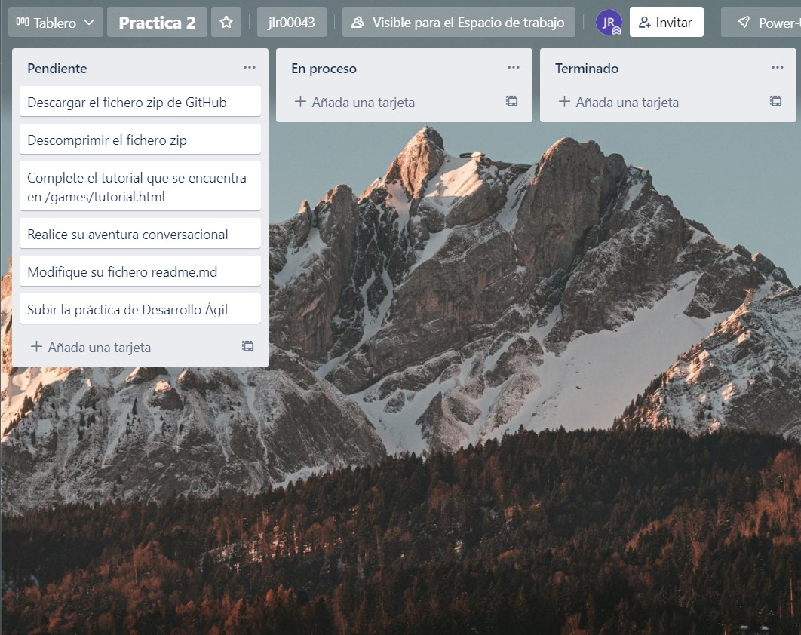
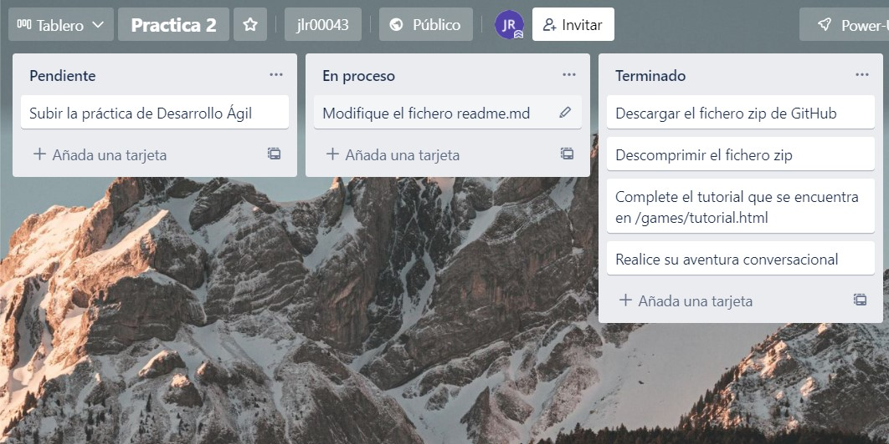
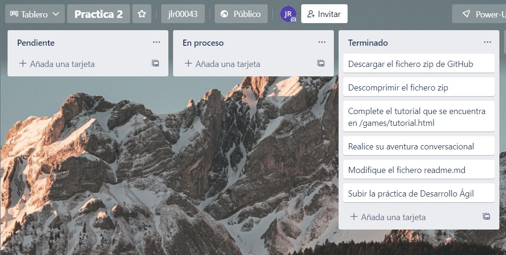
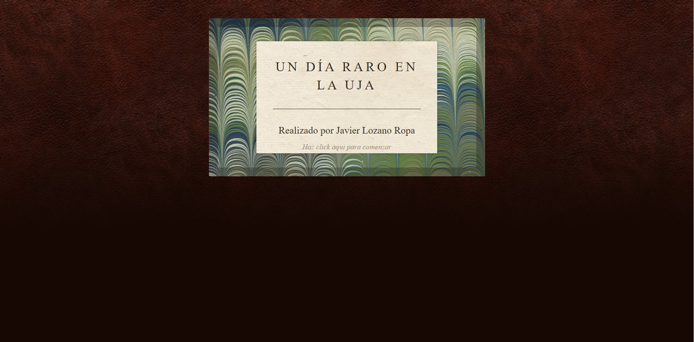

# Práctica 2 Desarrollo Ágil

## Índice

* [Autor](#autor)
* [Descripción del juego](#descripción-del-juego)
* [Capturas de pantalla del tablero Trello](#capturas-de-pantalla-del-tablero-trello)
* [Diseño de la aventura conversacional](#diseño-de-la-aventura-conversacional)

## Autor

* *Nombre*: Javier Lozano Ropa
* *Correo electrónico*: jlr00043@red.ujaen.es
* *GitHub*: https://github.com/jlr00043
* *Trello*: https://trello.com/b/0jLDK1TV/practica-2
* *Telegram*:@jaloro01
* *Asignatura:* Desarrollo Ágil
* *Curso:* 2021-2022

# Descripción del juego
## Un día raro en la UJA

Un día en la UJA parecía normal hasta que apareció un cadáver en los baños de la UJA y tendremos que ver qué es lo que ha ocurrido,
donde iremos pasando por diferentes sitios como una clase de la universidad y los propios servicios donde se encuentra descansando el 
cadáver.

# Capturas de pantalla del tablero Trello
En este apartado veremos las diferentes capturas que le hemos ido haciendo al tablero de Trello.

*Hacemos referencia a cómo se encontraba el tablero al principio de esta práctica.*

*A continuación, mostraremos cómo está el tablero tras haber realizado nuestra aventura conversacional y haber empezado a modificar el fichero Readme.md.*

*Por último, mostraremos el tablero tras haber terminado la práctica 2 de Desarrollo Ágil.*

# Diseño de la aventura conversacional

*En este apartado, podemos observar el diseño de la portada de nuestra aventura conversacional.*

